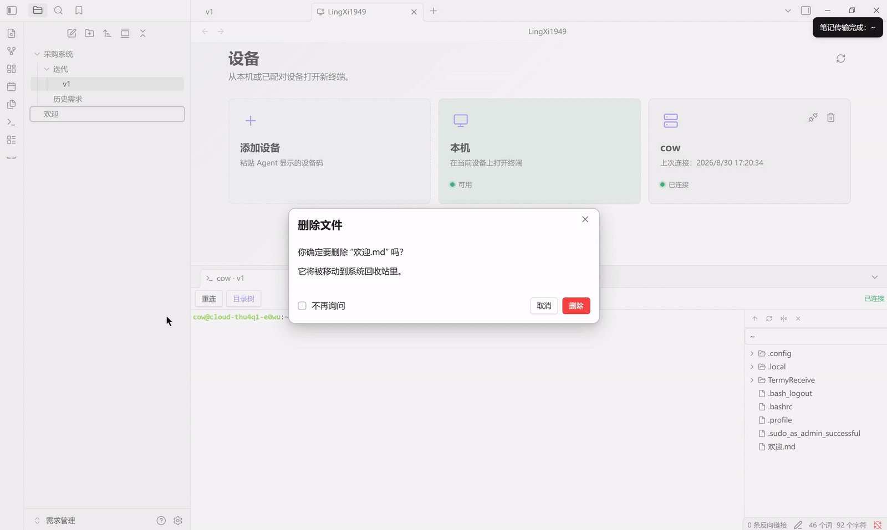
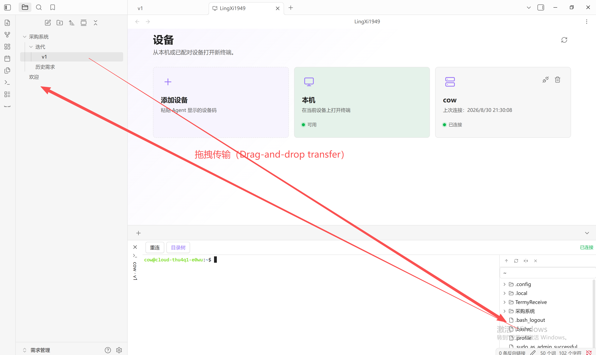
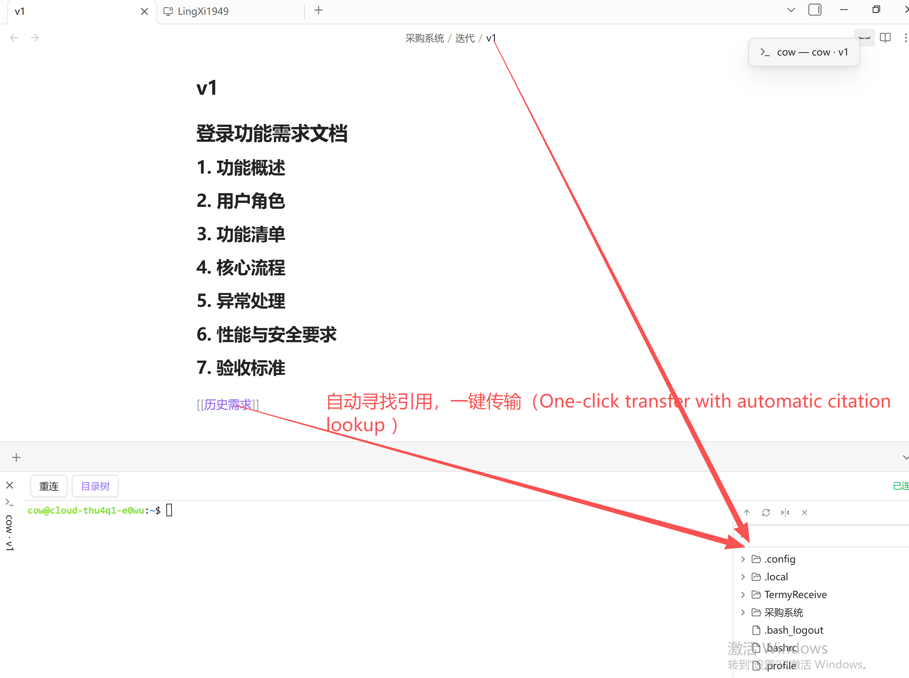

<div align="center">


# LingXi1949

An Obsidian terminal workspace for connecting local and remote devices and handing note context to AI CLI agents.

**Notes are the best friend you and your agent have.**

English / [简体中文](./README_ZH.md)

## Work without the friction

<table>
  <tr>
    <td width="50%" align="center">
      
    </td>
    <td width="50%" align="center">
      
    </td>
  </tr>
  <tr>
    <td colspan="2" align="center">
      
    </td>
  </tr>
</table>

## Main interface


## Linux Agent

First-time setup requires a few simple steps:

```bash
useradd -m cow

sudo usermod -aG sudo cow

passwd cow

su - cow
```

On Linux x64, run the installer as the ordinary user who will own the remote shell:

```bash
curl -fsSL https://raw.githubusercontent.com/Cyber-bike1949/LingXi1949/main/agent/packaging/install-linux.sh | bash
```

When installation finishes, use the connection code to add the device in LingXi1949.

## Windows Agent

Download the [Windows x64 Agent](https://github.com/Cyber-bike1949/LingXi1949/releases/latest/download/lingxi1949-win32-x64.exe) and its [SHA-256 checksum](https://github.com/Cyber-bike1949/LingXi1949/releases/latest/download/lingxi1949-win32-x64.exe.sha256).

Alternatively, run the following commands in PowerShell to download, verify, and start the Agent:

```powershell
$baseUrl = 'https://github.com/Cyber-bike1949/LingXi1949/releases/latest/download'
Invoke-WebRequest "$baseUrl/lingxi1949-win32-x64.exe" -OutFile 'lingxi1949.exe'
Invoke-WebRequest "$baseUrl/lingxi1949-win32-x64.exe.sha256" -OutFile 'lingxi1949.exe.sha256'
$expectedHash = (Get-Content 'lingxi1949.exe.sha256').Split()[0]
$actualHash = (Get-FileHash '.\lingxi1949.exe' -Algorithm SHA256).Hash
if ($actualHash -ne $expectedHash) { throw 'SHA-256 verification failed' }
.\lingxi1949.exe run
```

Keep the Agent running, then use its connection code to add the device in LingXi1949.

## Plugin usage

Add a device with its connection code, open a terminal, and start working from Obsidian.

- Drag and drop notes from Obsidian or files from the terminal to transfer them directly between devices.

- Send the current note and its related references to the terminal with one click. LingXi1949 automatically finds the referenced notes and includes them in the transfer.


## Current terminal features

- **Directory tree transfers:** browse local or remote directories, transfer files or folders, and drop onto an explicit target path.
- **Modification markers:** only files confirmed by a successful transfer receipt are marked. Clicking or dragging acknowledges the current version; folder markers aggregate marked descendants.
- **Operation history:** open a terminal pane menu and choose **History** to review user-entered shell operations for that session.
- **Shortcut groups:** save selected history entries as a device-specific group, then run the latest group from a terminal pane or a new terminal on its device. Device ownership is checked and uncertain completion pauses the run.
- **Transfer receipts:** supported Agents report per-file success, failure, or unknown status; older Agents remain compatible.

Shortcut replay never treats an uncertain completion as success or silently resends a step.

## Compatibility and verification

New directory metadata and per-file receipt fields are optional, so older peers remain usable. Verify the Agent connection, shell identity (`hostname` and `pwd`), and a sample note transfer before using real content. Full AI TUI readiness and shell-history edge cases still require verification on the target host.

</div>