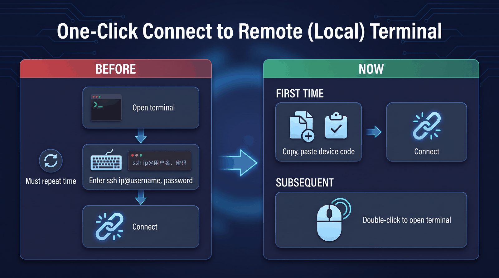
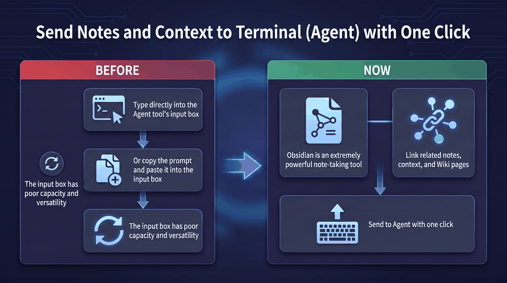
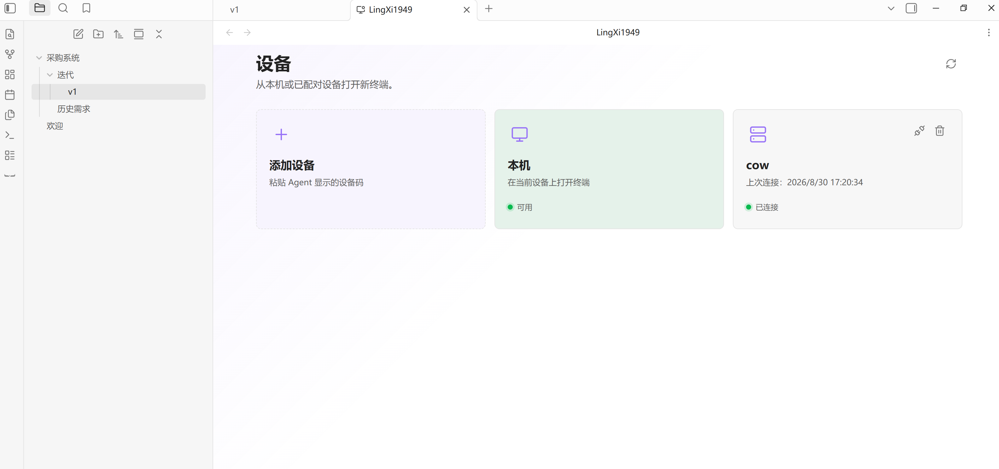

<div align="center">


# LingXi1949

An Obsidian terminal workspace for connecting local and remote devices and handing note context to AI CLI agents.

English / [简体中文](./README_ZH.md)

## Work without the friction

<table>
  <tr>
    <td width="50%" align="center">
      
    </td>
    <td width="50%" align="center">
      
    </td>
  </tr>
  <tr>
    <td colspan="2" align="center">
      <video src="assets/operate.mp4" width="980" controls></video>
    </td>
  </tr>
</table>

## Main interface



## Linux Agent

First-time setup requires a few simple steps:

```bash
useradd -m cow

sudo usermod -aG sudo cow

passwd cow

su - cow
```

On Linux x64, run the installer as the ordinary user who will own the remote shell:

```bash
curl -fsSL https://raw.githubusercontent.com/Cyber-bike1949/LingXi1949/main/agent/packaging/install-linux.sh | bash
```

When installation finishes, use the connection code to add the device in LingXi1949.

## Windows Agent

Download the [Windows x64 Agent](https://github.com/Cyber-bike1949/LingXi1949/releases/latest/download/termesh-agent-win32-x64.exe) and its [SHA-256 checksum](https://github.com/Cyber-bike1949/LingXi1949/releases/latest/download/termesh-agent-win32-x64.exe.sha256).

Alternatively, run the following commands in PowerShell to download, verify, and start the Agent:

```powershell
$baseUrl = 'https://github.com/Cyber-bike1949/LingXi1949/releases/latest/download'
Invoke-WebRequest "$baseUrl/termesh-agent-win32-x64.exe" -OutFile 'termesh-agent.exe'
Invoke-WebRequest "$baseUrl/termesh-agent-win32-x64.exe.sha256" -OutFile 'termesh-agent.exe.sha256'
$expectedHash = (Get-Content 'termesh-agent.exe.sha256').Split()[0]
$actualHash = (Get-FileHash '.\termesh-agent.exe' -Algorithm SHA256).Hash
if ($actualHash -ne $expectedHash) { throw 'SHA-256 verification failed' }
.\termesh-agent.exe run
```

Keep the Agent running, then use its connection code to add the device in LingXi1949.

## Plugin usage

Add a device with its connection code, open a terminal, and start working from Obsidian.

</div>