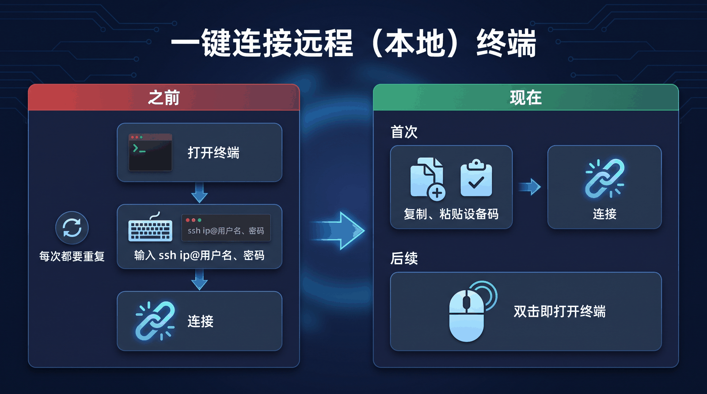
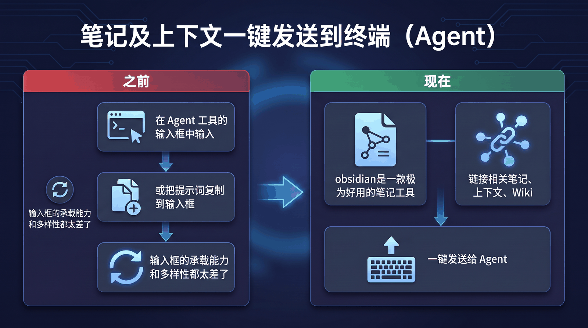

<div align="center">


# LingXi1949

连接本地与远程设备，并将笔记上下文交给 AI CLI Agent 的 Obsidian 终端工作台。

简体中文 / [English](./README.md)

## 告别繁琐操作

<table>
  <tr>
    <td width="50%" align="center">
      
    </td>
    <td width="50%" align="center">
      
    </td>
  </tr>
  <tr>
    <td colspan="2" align="center">
      <video src="assets/operate.mp4" width="980" controls></video>
    </td>
  </tr>
</table>

## 主界面


## Linux Agent
首次使用需要简单配置下
```bash
useradd -m cow

sudo usermod -aG sudo cow

passwd cow

su - cow
```

在 Linux x64 上，以将要使用远程 Shell 的普通用户身份运行安装脚本：

```bash
curl -fsSL https://raw.githubusercontent.com/Cyber-bike1949/LingXi1949/main/agent/packaging/install-linux.sh | bash
```

安装完成后，使用输出的连接码在 LingXi1949 中添加设备。


## Windows Agent

下载 [Windows x64 Agent 安装包](https://github.com/Cyber-bike1949/LingXi1949/releases/latest/download/termesh-agent-win32-x64.exe)及其 [SHA-256 校验文件](https://github.com/Cyber-bike1949/LingXi1949/releases/latest/download/termesh-agent-win32-x64.exe.sha256)。

也可以通过 PowerShell 下载、校验并启动 Agent：

```powershell
$baseUrl = 'https://github.com/Cyber-bike1949/LingXi1949/releases/latest/download'
Invoke-WebRequest "$baseUrl/termesh-agent-win32-x64.exe" -OutFile 'termesh-agent.exe'
Invoke-WebRequest "$baseUrl/termesh-agent-win32-x64.exe.sha256" -OutFile 'termesh-agent.exe.sha256'
$expectedHash = (Get-Content 'termesh-agent.exe.sha256').Split()[0]
$actualHash = (Get-FileHash '.\termesh-agent.exe' -Algorithm SHA256).Hash
if ($actualHash -ne $expectedHash) { throw 'SHA-256 verification failed' }
.\termesh-agent.exe run
```

保持 Agent 运行，然后使用输出的连接码在 LingXi1949 中添加设备。

## 插件端使用

输入连接码添加设备，打开终端，即可在 Obsidian 中开始使用。

</div>